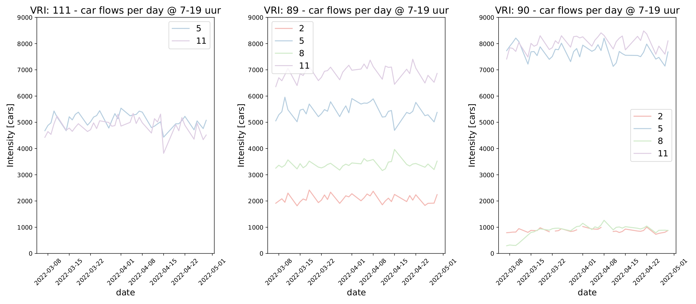
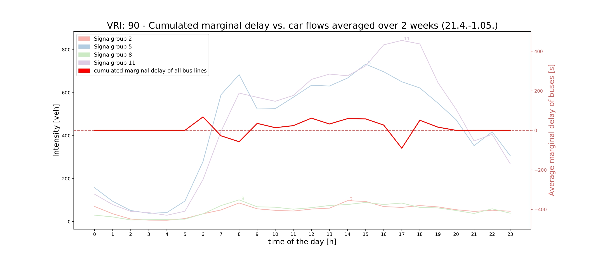
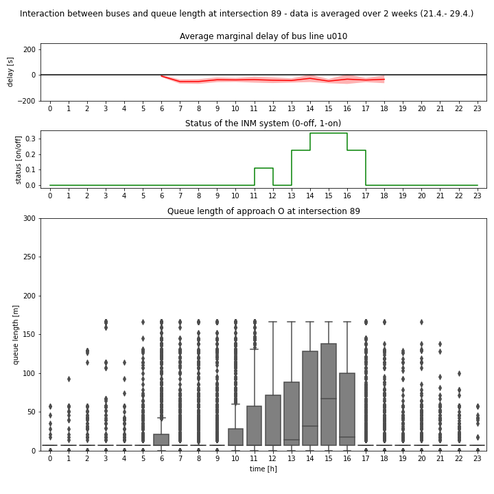
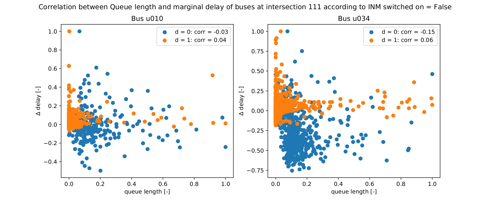
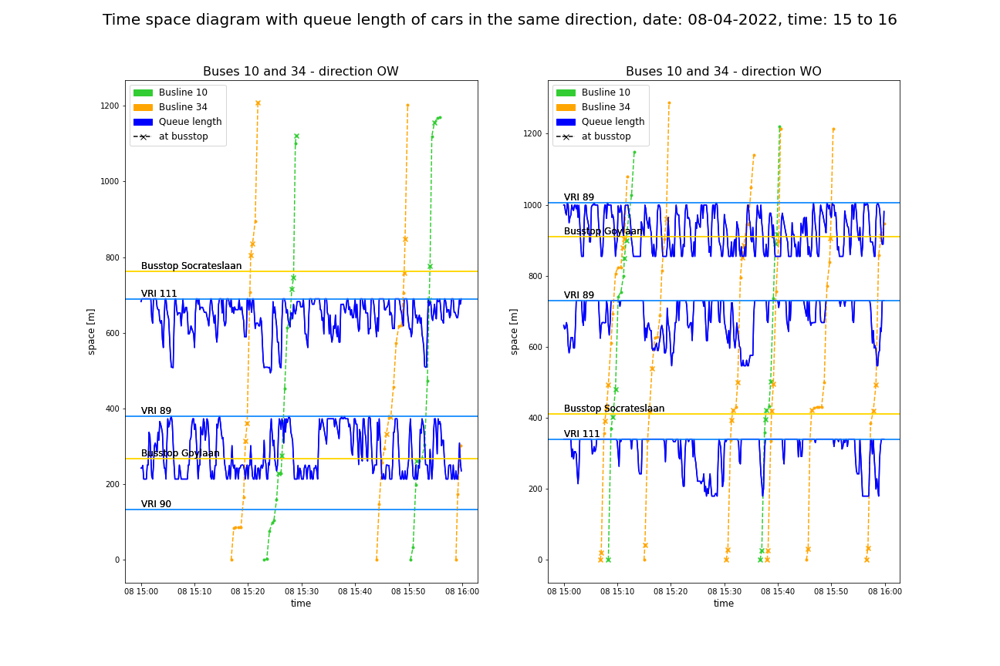

# Utrecht: Integrated Network Management (INM)
This repository contains the code which was produced during the Master Thesis of Paula Vogg at TU Delft. The project is an extension for public transport of an existing traffic control logic called Integrated Network Management (INM). For the Master Thesis an extensive data analysis with public transport data and system data was performed. ¨
The data analysis is structured in three levels of detail (macro, meso, micro). The codes for the macro and meso analysis are in the folder with the flow data. 
Data files:
- The flow data is obtained from the provided excel files and saved as complete csv files.
- The data from the Arane data portal is obtained with an API in the code. 
- The public transport data from NDOV needs to be retrieved day by day and placed in the NDOV folder (exact instructions in the micro analysis codes). The chosen dataset is called kv6.

Hereafter some example plots: 

## Macro analysis
We analyse flow data over the period of two months to detect irregularities. Only workdays are considered.

    
## Meso analysis
We analyse the traffic behavior for one day. The data is averaged over 2 weeks to avoid irregularities of a specific day.

This second plot shows the marginal delay of a specific bus in a specific direction, together with the system status, and the queue length of cars.

## Micro analysis
We look more specifically at the rushhour of the day, and analyse the correlation between the marginal delay of buses and the queue length of cars. 

The time space diagram shows the trajectories of the buses (green and yellow) and the queue length (blue) at the intersection in the direction of the bus.

